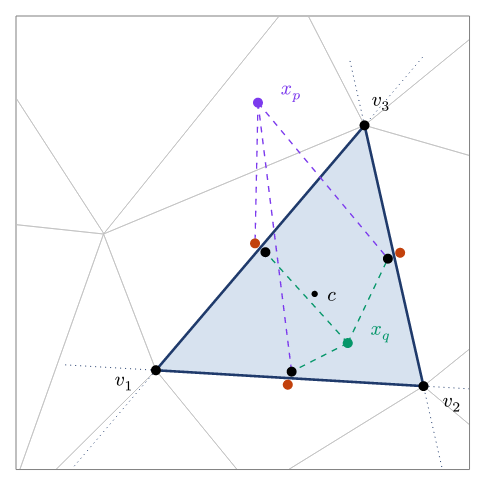
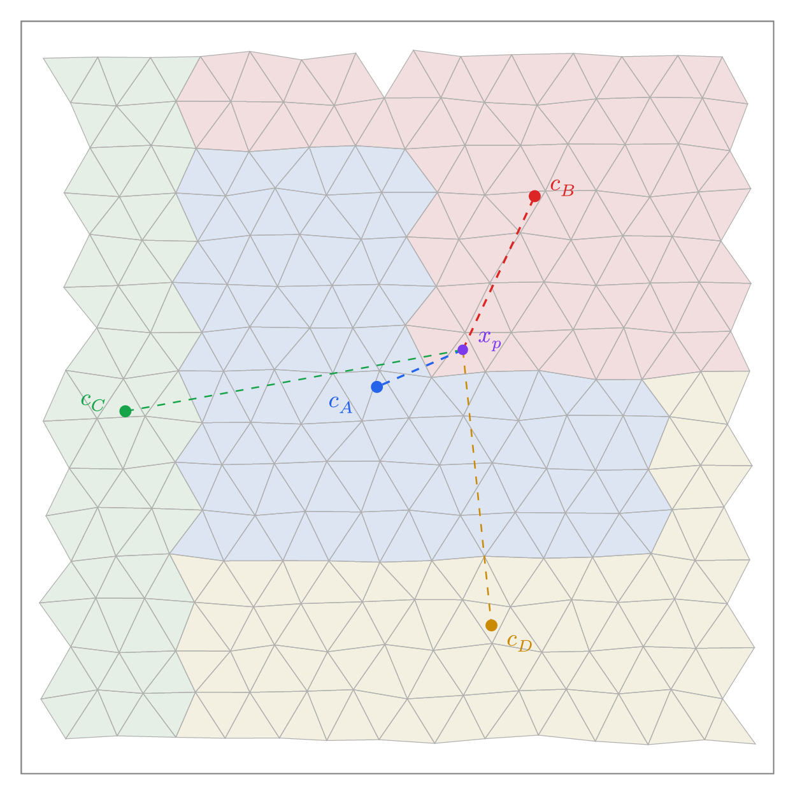
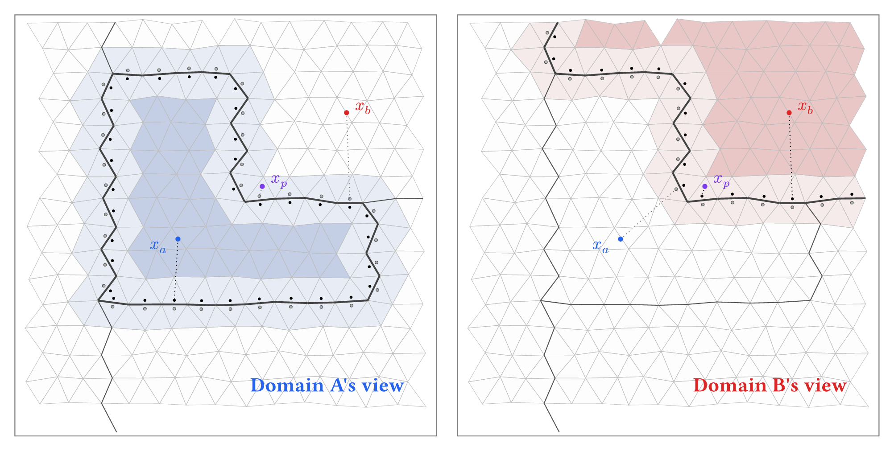

# Finding Particles in a Parallel Mesh

Lagrangian particles are central to geodynamics modelling. They track material properties through large deformation, carry stress history for viscoelastic models, and define material interfaces. But managing particles in a finite element mesh is harder than it looks. On a structured grid, finding which cell contains a given point is arithmetic. On an unstructured mesh of triangles or tetrahedra, it is a search problem. And when the mesh is decomposed across processors, it becomes a distributed search problem with communication costs.

This post describes how Underworld3 locates particles in an unstructured mesh, and then how it extends that to work across a parallel decomposition.

## The Geometric Problem

Given a point $x$ and an unstructured mesh of convex cells, which cell contains $x$? On a structured grid you compute an index. On an unstructured mesh, you have to test cells until you find one that contains the point.

Testing whether a point is inside a convex cell is straightforward in principle. Each face of the cell defines a half-space. If the point is on the interior side of every face, it is inside the cell. For a triangle with three edges, that is three half-space tests. For a tetrahedron with four faces, four tests.

The expensive part is deciding which cells to test. A brute-force scan over all cells is $O(N)$ per particle. With millions of particles and millions of cells, this is prohibitive. UW3 uses a two-stage approach: a fast approximate lookup followed by a geometric confirmation.

### Stage 1: Approximate Lookup via KDTree

A naive approach would be to find the cell whose centroid is nearest to the particle. This fails for unstructured meshes. In a Delaunay triangulation, cells can be far from equilateral. A long, thin triangle has its centroid near the middle of the long axis, far from a point that sits inside the triangle near one of its acute vertices. A neighbouring, more equilateral triangle may have a closer centroid even though the point is not inside it.

UW3 addresses this by placing multiple control points per cell: one near each vertex (nudged 1% toward the cell centroid) plus the centroid itself. This ensures that every region of the cell is close to at least one of its control points, regardless of aspect ratio. All control points across the mesh are stored in a KDTree built on nanoflann, a C++ nearest-neighbour library providing $O(\log n)$ queries.

Given a particle position, the KDTree returns the nearest control point, which maps to a candidate cell. The vertex-nudged points make this a much better guess than centroid-only lookup, but it is still not guaranteed correct for points near cell boundaries.

### Stage 2: Inside/Outside Confirmation



*An unstructured triangulation with a highlighted element. Each face carries a pair of control points: one just inside the cell (black) and one just outside (rust). A test point is connected to the marker on the same side of each face as the centroid: $x_q$ — interior — lands on three black markers; $x_p$ — exterior — lands on a rust marker for the face it has crossed. A point is inside the cell iff every connection is black.*

To confirm that a particle is inside its candidate cell, UW3 uses precomputed control point pairs on each face. During mesh setup, each face gets two markers: one placed just inside the cell (offset by a small distance along the inward normal from the face centroid) and one just outside. These are the black and orange dots in the diagram.

At query time, the test is purely distance-based. For each face, compare the squared distance from the particle to the outer control point versus the inner control point:

$$
\| x - x _ \text{outer} \|^2 - \| x - x _ \text{inner} \|^2 > 0
$$

If the particle is closer to the inner point, it is on the centroid side of that face. A particle is inside the cell if and only if this holds for all faces.

No normals, no dot products, no plane equations at query time. The geometry was baked into the control point positions during mesh setup. The computation is vectorised over all particles and all faces using NumPy. For a triangle, this is three distance comparisons per particle. For a tetrahedron, four.

This approach is exact for linear meshes where faces are planar. For higher-order elements with curved faces, it is approximate but sufficient for particle location.

### When the Candidate Is Wrong

If the KDTree returns a candidate cell and the inside/outside test fails, the particle is in a neighbouring cell. The algorithm queries the KDTree for the next-nearest control point, tests that cell, and repeats. In practice, the first candidate is almost always correct, and at most one or two iterations are needed.

## Scaling to Parallel

On a single processor, the algorithm above is sufficient. On a parallel mesh, each processor owns a subset of cells. A particle that has moved outside its processor's domain needs to be found, relocated to the correct processor, and have all its variable data transferred.

### Migration Between Processors

After advection, particles that are outside their local domain need new owners. The first step is deciding where to send them. Each MPI rank computes its domain centroid, and a KDTree is built from all centroids across all ranks. For a displaced particle, the nearest centroid gives a candidate destination.



*A mesh decomposed into four processor domains. The particle $x _ p$ is inside domain B but closer to domain A's centroid $c _ A$ than to $c _ B$. A nearest-centroid assignment would send the particle to the wrong processor. Dashed lines show distances to all four domain centroids. The domain shapes here are exaggerated for illustration. Real decomposition tools like METIS produce more compact domains that minimise boundary surface area, but the centroid ambiguity still arises near irregular partition boundaries.*

The centroid ambiguity illustrated above is the parallel analogue of the elongated-triangle problem at the element level. Domain decompositions are irregular, and a domain's centroid does not represent all of its territory equally. So the centroid KDTree gives a candidate, not a final answer. Once a particle arrives at its candidate processor, it needs to be verified.

### Domain Ownership Test

Each processor needs to confirm whether an arriving particle is actually inside its local domain. UW3 places control point pairs along the boundary faces of the processor's subdomain, just as it does for individual cells. Boundary faces are identified as faces belonging to only one cell (they sit on the edge of the local partition). Each face gets an inside marker and an outside marker, and a KDTree is built from all of them.

For a given particle, the nearest boundary control point is found. If it is an inside marker and the particle is far from the boundary, the particle is clearly inside the domain. If it is an outside marker and the particle is far away, the particle is clearly outside. These two cases are fast.



*Each panel shows one domain's view. Dark shading marks the region that is clearly inside (far from any boundary control point). Light shading marks the boundary zone where the sign of the nearest control point is not reliable. White is clearly outside. Black dots are inside control points; grey dots are outside control points. The particle $x _ a$ is clearly inside A and clearly outside B. The particle $x _ b$ is the reverse. The particle $x _ p$ falls in the boundary zone of both domains and requires the more expensive cell-location test to resolve.*

The boundary zone exists because processor subdomains are typically non-convex. For a convex domain, the nearest-control-point sign would always give the correct answer. But when the boundary folds back on itself, a particle near one part of the boundary might have its nearest control point on a different, unrelated part of the boundary. The sign of that control point tells you nothing useful about which side of the nearby boundary the particle is on. In this zone, UW3 falls back to the full cell-location test from the element-level algorithm: find the candidate cell via the KDTree, confirm with the face control point pairs.

### Putting Migration Together

The full migration sequence is iterative:

1. Check which particles are still inside the local domain using the ownership test.

2. For particles that are outside, query the domain centroid KDTree to find the closest rank. Assign the particle to that rank.

3. Call PETSc's `dm.migrate()` to exchange particles between ranks. PETSc handles the MPI communication: packing particle coordinates and all swarm variable data, sending to the target rank, unpacking on arrival.

4. The receiving rank runs the ownership test. Some particles may have been sent to the wrong rank (nearest centroid, but not the owning domain). For these, query the next-closest centroid and repeat.

5. After a fixed number of iterations, any particles still unlocated are deleted. These are typically particles that have left the mesh entirely.

In practice, most particles arrive at the correct rank on the first attempt. The iteration catches the edge cases near irregular boundaries.

## Creating Particles

Particles are created by populating a swarm on the mesh:

```python
swarm = uw.swarm.Swarm(mesh)
swarm.populate(fill_param=3)
```

The `fill_param` controls density. It places particles at the locations of discontinuous basis functions of degree `fill_param` within each cell. At `fill_param=3`, this gives roughly 10 particles per cell in 2D and 20 in 3D. The distribution is designed to be well-suited for numerical integration and RBF interpolation.

Particles can also be added manually:

```python
swarm.add_particles_with_coordinates(local_coords)
```

This is a local operation. Each rank adds particles in its own domain. For placing particles across all ranks from a single coordinate array, `add_particles_with_global_coordinates()` handles the distribution and migration collectively.

## Swarm Variables and Solvers

Particles carry data through swarm variables. Each variable is stored as a PETSc field on the DMSwarm, so when particles migrate, their data travels with them automatically. How that data participates in the finite element solver — projection onto the mesh, lazy evaluation, symbolic integration — is the subject of a separate post.

## What Is Not Automatic

UW3 does not currently perform active population control. If particles cluster in a convergence zone or deplete in a divergence zone, the user is responsible for adding or removing particles. The `add_particles_with_coordinates()` method handles insertion, but deciding when and where to add particles is a modelling decision that the framework does not make for you.

This is a known limitation and an area where contributions are welcome. Population control strategies exist in the literature, but implementing them well in parallel, without introducing artefacts, is non-trivial.

## The Full Timestep

From this post's perspective, the particle-relevant part of a timestep is:

1. **Advect**: Particle coordinates are updated using the velocity solution.

2. **Locate**: Each particle is tested against its current cell using the face control point test. Particles that have left their cell are relocated using the KDTree lookup.

3. **Migrate**: Particles that crossed processor boundaries are sent to their new owners via the centroid hinting and ownership verification described above. PETSc exchanges particle coordinates and all swarm variable data between ranks.

How the solver uses particle data, and how swarm variables participate in the weak form, is the subject of a companion post.

---

*The Underworld project is supported by AuScope and the Australian Government through the National Collaborative Research Infrastructure Strategy (NCRIS). Source code: [github.com/underworldcode/underworld3](https://github.com/underworldcode/underworld3)*
